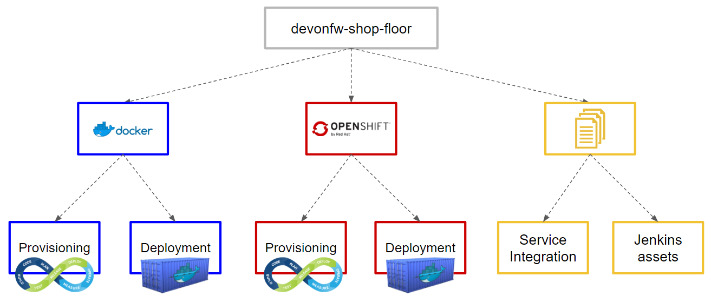

# Devonfw Shop Floor

## devonfw-shop-floor 4 Production Line

The **Production Line** part of the devonfw-shop-floor corresponds with a guide of setting up or **prepare your PL instance** to be used by Devonfw projects.

More info in the **devonfw-shop-floor 4 Production Line** Wiki section.

## devonfw-shop-floor 4 Docker

This option is the "fastest" one. Perfect to ramp up a complete **CI/2CD/COMS** environment in a matter of seconds.

As the environment is based on pure **Docker**, just one command should be executed:

`# docker-compose up`

After the environment installation (Jenkins, Nexus, Mattermost, ...) the integration between them should be done. Follor the Wiki documentation regarding **devon-shop-floor 4 Docker - Service Integration** section for that.

Both `docker-compose.yml`(s) are using a `version: "2"` of Docker Compose, so that means a minimum version of Docker (`v1.10.0+`) is mandatory.

If your remote server's OS is _i.e._ **RHEL 6.5**, the maximum version you could install is `v1.7`. There's also a `docker-compose-v1.yml` for those situations located in `/devonfw-shop-floor/dsf4docker/v1/`. There is a practical experience in this repo's Wiki about the [Mirabaud Case](https://github.com/devonfw/devonfw-shop-floor/wiki/mirabaud-cicd-environment-setup).

More details in the [dsf4docker](https://github.com/devonfw/devonfw-shop-floor/tree/master/dsf4docker) README file.

## devonfw-shop-floor 4 OpenShift

The OpenShift part is a set of resources that allows teams to quickly have:

1. OpenShift cluster up and running
2. Devonfw s2i templates (both for Angular and Java) to build images and run them as containers in OpenShift
3. The `openshift.json` file that should be incorporated in the project's root directory.

## Changes in Devonfw projects

Some additions of plugins, configuration files and so on need to be make in Devonfw projects to, for example, run them in SonarQube, deploy their artifacts in Nexus, run unit tests in a headless Chrome window, etc.

More specific info in the Wiki.

### Angular projects

1. Add `ChromeHeadless` browser in the `karma.conf.js` file
2. Add a `build:pro` yarn script in `package.json`

### Java projects

1. Add `<distributionManagement>` section in the parent `pom.xml`
2. Add `sonar:sonar` plugin and `jacoco` for code coverage

## What does **Devonfw Shop Floor** offers?

### Production Line:
- [How to configure](https://github.com/devonfw/devonfw-shop-floor/wiki/devonfw-shop-floor-4-production-line-environment) your Production Line instance to run **devonfw** projects.

### Docker:
- Complete CI/CD/COMS environment for teams installed with **docker-compose**.
- Service integration/configuration using [documentation](https://github.com/devonfw/devonfw-shop-floor/wiki/devonfw-shop-floor-4-docker).
- [How to deploy](https://github.com/devonfw/devonfw-shop-floor/tree/master/dsf4docker/devonfw-deployment) **Devonfw** projects using **docker-compose**

### OpenShift:
- Scripts for the installation of an **OpenShift Origin v3.6** installation (once **docker** and **openshift client (oc)** are installed).
- **Devonfw templates** for **Angular** and **Java** projects, for deployment in the cluster.
- Deployment script (alterative way of deployment, instead of using the OpenShift dashboard).

### Backup:
- Scripts to make backups of your databases in a remote machine (production-like machine).
