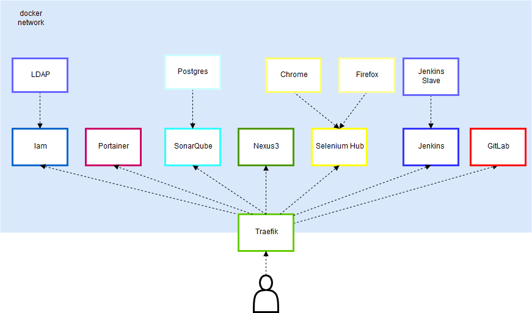

# Devonfw CICD Environment

## Architecture overview



## Install Devonfw Shop Floor 4 Docker

There is an installation script to do so, so the complete installation should be completed by running it. Make sure this script has execution permissions in the Docker Host:

```
# chmod +x dsf4docker-install.sh
# ./dsf4docker-install.sh
```

This script, besides the container "installation" itself, will also adapt the `docker-compose.yml` file to your host (using `sed` to replace the **IP_ADDRESS** word of the file for your real Docker Host's IP address).

## Uninstall Devonfw Shop Floor 4 Docker

As well as for the installation, if we want to remove everything concerning **Devonfw Shop Floor 4 Docker** from our Docker Host, we'll run this script:

```
# chmod +x dsf4docker-uninstall.sh
# ./dsf4docker-uninstall.sh
```
