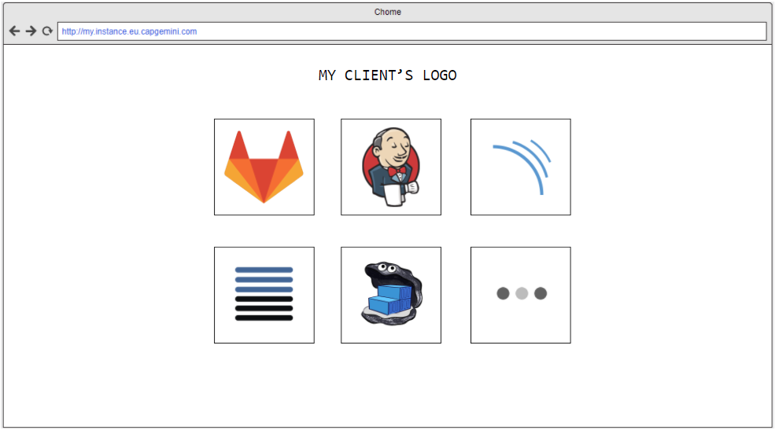

# Development Portal

This project is intended to serve as an Entry Point for development teams (developers and managers) to their Devonfw-based Development/Integration Environment (**Openshift** Cluster, **docker-compose** container structure).

This **Development Portal** is developed in Angular, and it is based on this dessign:

You can find here some slides about that: https://docs.google.com/presentation/d/1R2YZkDzD2fQCSJiuWNE9SocQGXLcmJBVzvCXaNfibek/edit?usp=sharing
